# ¿Cómo funciona una PC y que hace cada pieza? |Componentes del ordenador explicados |Resumido así nomás

# El procesador o CPU

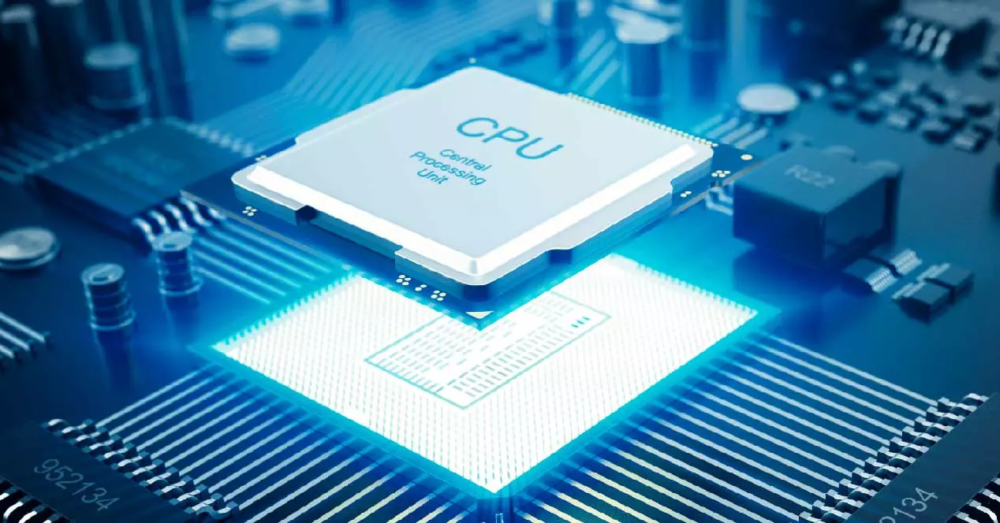

# Te has preguntado ¿Por qué Sillcon Valley es la capital de los centros de tecnología?

Pues porque hay se encuentra mucho material que hace posible el funcionamiento de la computadoras el Silicio (no confundir con Silicon)  un material semiconductor, en el que se encuentra el procesador 

🧠🧮

---

En un principio las computadora nos ayudan a trabajar con números, de forma más rápida y eficiente. Le dábamos un input (entrada) a calcular, la computadora almacenaba la información y le solicitamos las operaciones, mediante una serie de pasos pre-definidos nos devuelve una salida (output)

---

## ¿Qué es el procesador?

Se tiene la analogía de que una computadora es como un cerero humano. Y esta analogía funciona en muchos niveles ya que una parte se encarga de hacer cálculos matemáticos y seguir instrucciones. En la computadora esta parte es el procesador. 

## La Memoria

Pero nuestro cerebro no solo hace cálculos matemáticos también es capaz de guardar la información que percibimos de nuestro entorno. Y acceder a ella cuando la necesitamos. 

En la computadora también se necesita que se almacena la información. 

Esto se lleva a cabo en los discos duros.

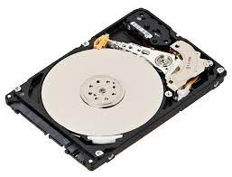

Pero ahora esta evolucionando al M.2

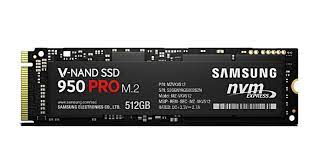

Lo que hace es almacenar la información como datos es decir 1 y 0.

# ¿Porqué almacenamos datos? | La esencia de la ciencia de datos

## Tycho Brahe

## Johannes Kepler

Tycho Brahe y Johannes Kepler querían saber porque los planetas se movían como pero como faltaban años para que Isaac Newton desarrollara el calculo, entonces empezaron a dibujar el movimiento de los planetas con la esperanza de que alguien lo descubriera en el futuro. Es es la esencia de la ciencia de datos almacenarlos para que alguien los utilice en el futuro. Por eso es que necesitamos guardar datos en nuestra computadora

## La memoria RAM

Sin embargo el tratar de guardar todos esos datos es un proceso extremadamente lento. 

Para solucionar esto es que se invento la Memoria RAM 

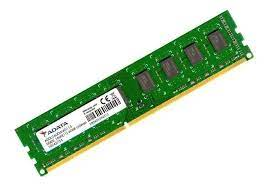

### ¿Qué significa RAM?

Son las siglas en ingles Random Access Memory 

⚡

La RAM es un a memoria volátil. Lo que quiere decir que si el equipo se apaga o falla la corriente eléctrica la información se pierde   

## ¿Cómo funciona?

En vez de que el procesador trabaje directamente con los datos en el almacenamiento usa la RAM como intermediaro, para trabajar los datos directamente hay para cuando esten listos guardarlos en el almacenamiento permanente. 

 

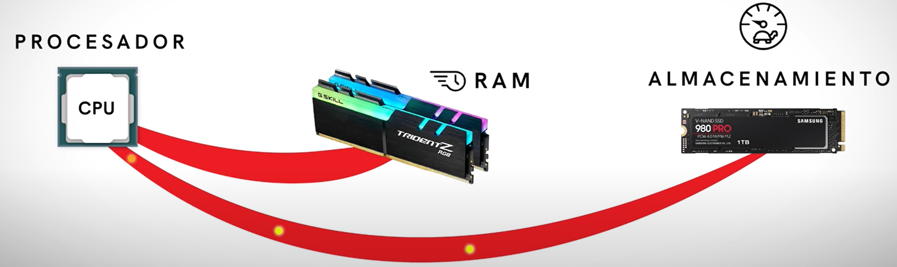

# En la Motherboard

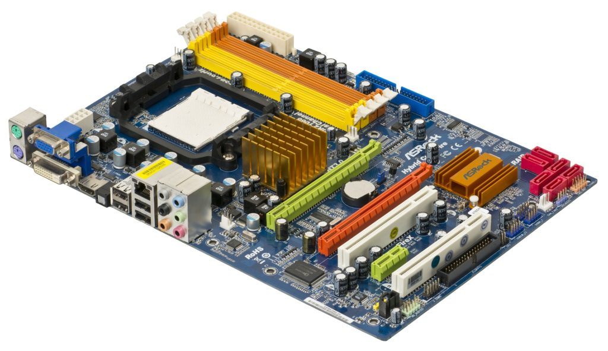

Es la conexión de muchos de los elementos anteriormente mencionados. 

☕

Anteriormente si derramabas café sobre tu computadora la dabas en la motherboard a tu computadora.

⚡

---

## La fuente de alimentación

Los humanos necesitamos comida para obtener energía y realizar nuestras actividades.

Las computadoras se alimentan de energía eléctrica. Toma la corriente eléctrica y la distribuye en diferentes pares de nuestro PC.  

Igual que la sangre   distribuye la glucosa y el oxigene alrededor de nuestro cuerpo. 

Si pasáramos toda la energía eléctrica directamente a nuestro Procesador se quemaría por eso hay que regular el voltaje como presa que evita que pase toda el agua sino que pasa por fases y las fases filtran la corriente hasta dar voltajes precisos.

---

🔥

## El Disipador

La corriente que fluye se queda en el camino y se convierte en calor. 

Si lo dejáramos correr como si nada el procesador se quemaría, para eso existe el disipador 

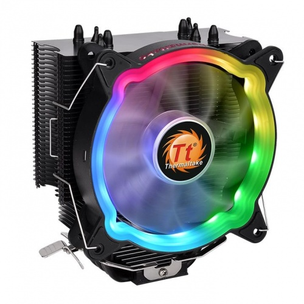

Un disipador es un ventilador con un sistema de bombeo de agua que refresca nuestro ordenador.

---

## PCH | Platform Controller Hub

Es el administrador del procesador que recibe las señales de todos los elementos externos . Podríamos decir que el Procesador es como el Gerente ejecutivo de una empresa y el PCH es el recepcionista que atiende a todos los que van llegando para administrar quien y como habla con el procesador. 

---

## La Tarjeta gráfica

El procesador puede hacer cálculos de cualquier cosa. Excepto los cálculos de pantalla.

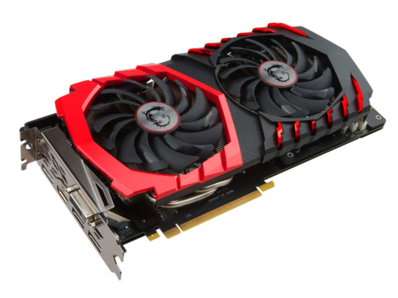

Lo que nosotros vemos en pantalla no son más que puntos de colores ordenados que en conjuntos y visto desde lejos forma una imagen. También llamados pixeles

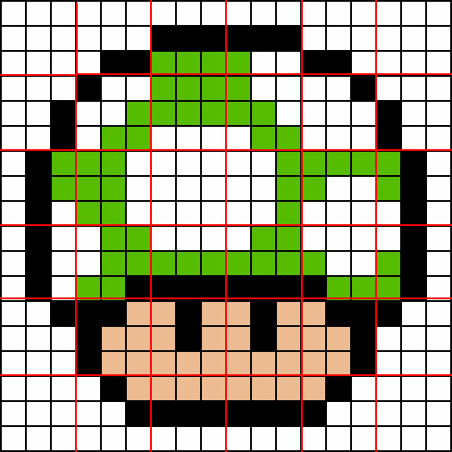

## Para videojuegos o efectos especiales

Para hacer cosas más sofisticadas que simples gráficos como imagen tridimensionales o imágenes poligonales , comúnmente en videojuegos o efectos especiales necesitan una tarjeta grafica dedicada, que convierte imágenes graficas de 3D a 2D.

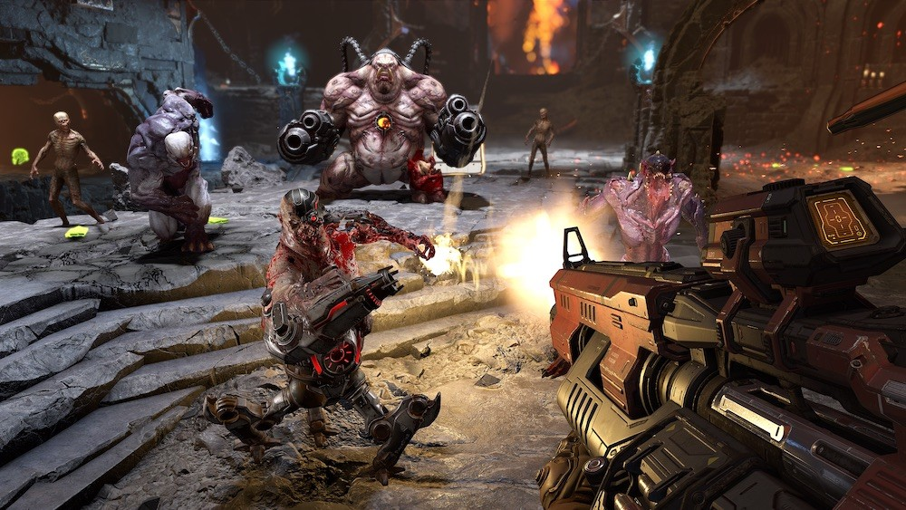

## ¿Cómo funciona?

El procesador le pide a la tarjeta grafica que decodifique y cree los pixeles para visualizar las imágenes

Recuerda que todo en la computadora son datos. Al abrir el juego el procesador le pide a la memoria que cargue los datos en la memoria RAM"

El procesador le dice a la tarjeta grafica los datos para calcularlos y mostrarlos en pantalla 

> *"Tranquilo cariño, ya llego la caballería". -Tracer, Ovewatch*
> 

---

## Para otros componentes| La BIOS

BIOS son las siglas de Basic Input Output System. Se puede decir que es el intermediario entre los elementos del hardware y el software. Cuando nosotros iniciamos nuestra PC el BIOS se encarga de asegurarse que todo este funcionando correctamente y como debería. 

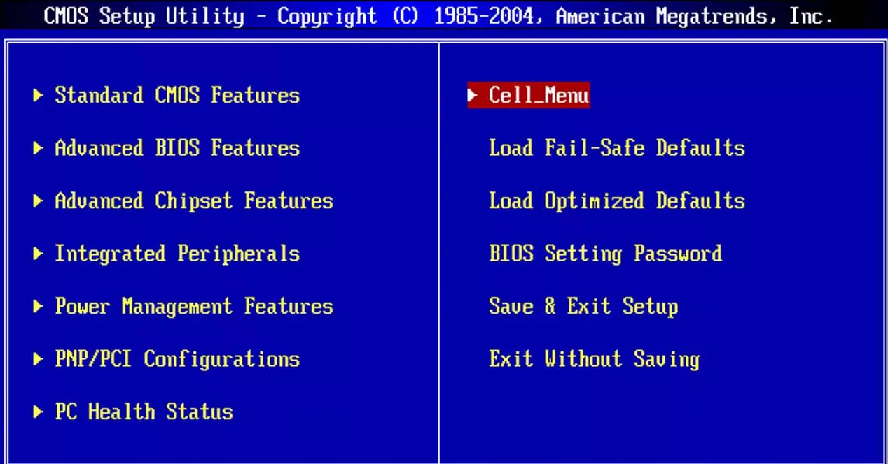

---

## La Caja

Sencillamente es una forma de protección del hardware 

---

Si quieres más información mira el video completo 

[https://youtu.be/0zkX6nlpiSk](https://youtu.be/0zkX6nlpiSk)

---

[¿Qué es lo que entiende una computadora?](https://www.notion.so/Qu-es-lo-que-entiende-una-computadora-be4d46e281454b8fbdf26bdfa2db5413?pvs=21)

# Sobre el autor

<a class="badge-base__link LI-simple-link" href="https://mx.linkedin.com/in/fernando-sanchez-mejia?trk=profile-badge">Fernando Sanchez Mejia</a>

